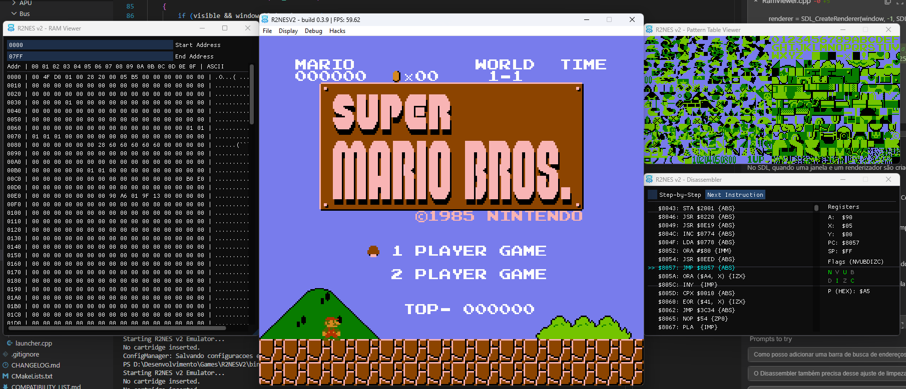
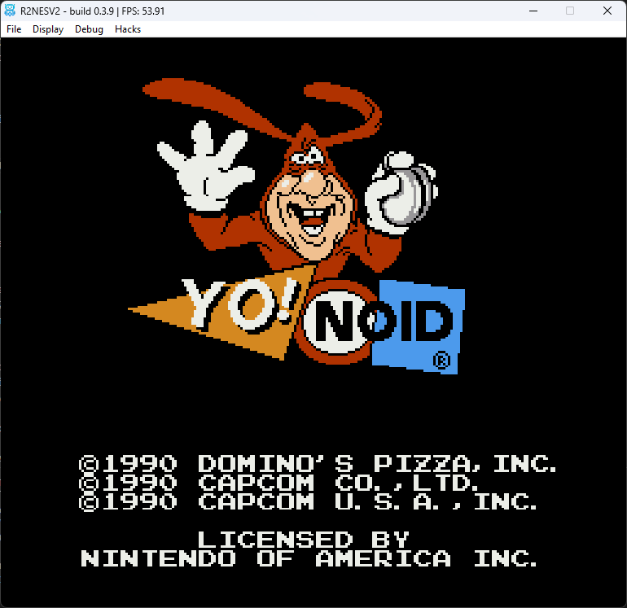
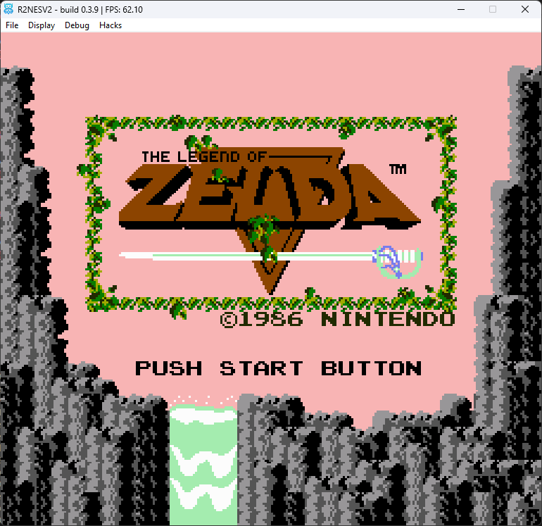

# R2NES V2

<div align="center">
  
</div>

---

R2NES V2 is a Nintendo Entertainment System (NES) emulator written in C++17. It includes a desktop interface, audio and controller support, save states, and tools for inspecting emulated video hardware.

The project is actively developed. PPU timing, mapper behavior, and compatibility are still being improved; support for a mapper does not guarantee that every game using it will work correctly.

No ROMs are included. Load your own legally obtained `.nes` image or a `.zip` archive containing a `.nes` image.

Prebuilt packages are published on the [GitHub Releases page](https://github.com/jpaulobf/R2NESV2/releases). You can also build the project from source using the instructions below.

## Features

- **CPU:** Emulation of the NES Ricoh 2A03 CPU.
- **PPU:** Background and sprite rendering, scrolling, sprite priority, and Sprite 0 Hit. Timing behavior is under active development and is not fully cycle-accurate.
- **APU:** Pulse 1, Pulse 2, Triangle, Noise, and DMC audio channels, with per-channel controls.
- **Mappers:** Implementations are present for iNES mapper IDs 0, 1, 2, 3, 4, 5, 7, 9, 11, 23, 40, 66, 90, and 187. Accuracy and game compatibility vary; see the [compatibility notes](COMPATIBILITY_LIST.md).
- **ROM loading:** `.nes` files and `.zip` archives containing a `.nes` file.
- **Save states:** Three selectable slots, stored under `savestates/` and named for the loaded ROM.
- **Debug tools:** Viewers for VRAM, palettes, OAM, and pattern-table tiles, plus a CPU disassembler.
- **Display options:** Several palette presets, scanline and shader options, and an unlimited-sprite mode.
- **Convenience:** Recent ROM history and persistence of the last opened directory.
- **Input:** Keyboard and up to two SDL game controllers. The Zapper can be enabled for the second port and aimed with the mouse.

### Compatibility notes

Mapper coverage and PPU/APU timing are incomplete. Some games rely on board-specific mapper behavior or precise CPU/PPU timing that R2NES does not yet reproduce. A small number of ROM-specific Sprite 0 wait-loop workarounds are present; these are narrow compatibility exceptions, not general timing fixes.

The unlimited-sprite option relaxes the NES limit of eight sprites per scanline. It can reduce flicker, but changes hardware behavior; turn it off when checking the normal sprite limit or game compatibility.

The [compatibility list](COMPATIBILITY_LIST.md) records game observations and is maintained as testing progresses. It is not a claim of complete compatibility or hardware accuracy.

## Build from source

### Requirements

- CMake 3.14 or newer
- A C++17 compiler
- Git and an internet connection for CMake to fetch SDL2, Dear ImGui, and zlib during configuration
- On Windows, MinGW-w64 with GCC, G++, and `mingw32-make`
- On Linux, the system development libraries required to build SDL2; the [release workflow](.github/workflows/release.yml) lists the packages used by CI

### Windows (MinGW-w64)

Run these commands from the repository root:

```powershell
cmake -S . -B build -G "MinGW Makefiles" -DCMAKE_BUILD_TYPE=Release
cmake --build build --config Release
```

### Linux

Install the requirements above, then run:

```bash
cmake -S . -B build -DCMAKE_BUILD_TYPE=Release
cmake --build build --config Release --parallel
```

The executable and copied resources are placed in `bin/`.

## Default controls

| Action | Keyboard | Controller |
| --- | --- | --- |
| Direction | W / S / A / D | D-pad or left stick |
| A / B | K / J | A / B and configured face buttons |
| Turbo A / Turbo B | I / U | Configured turbo buttons |
| Select / Start | Backspace / Enter | Back / Start |
| Fast forward | Hold Tab | — |
| Pause | P | — |
| Save state / Load state | F5 / F6 | — |
| Window scale | F7–F10 | — |
| Borderless fullscreen | F11 | — |
| Reset | F12 | — |
| Rewind | Hold Caps Lock when enabled | — |
| Zapper trigger | Left mouse button when Zapper is enabled | — |

Choose the save-state slot from **File → Save State Slot**. Enable the Zapper from the **Input** menu.

## Screenshots







## License

R2NES V2 is distributed under the GNU General Public License v3.0. See [LICENSE](LICENSE) for the full text.
